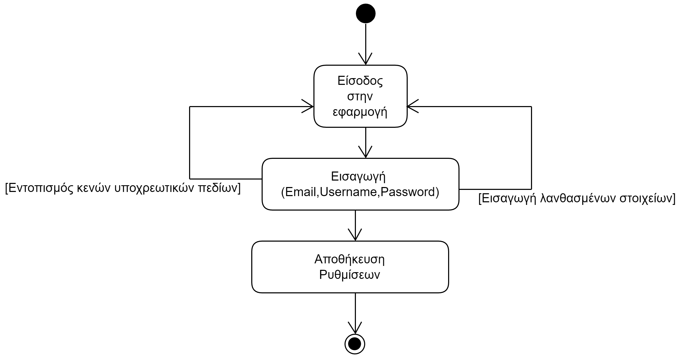

# Team 23

Το παρόν έγγραφο αναφέρεται σε ένα 
Σύστημα Παραγγελιών επιχειρήσεων εστίασης. Στη συνέχεια παρατίθεται μία συνοπτική περιγραφή των απαιτήσεων του πεδίου προβλήματος. Τέλος περιγράφεται και το διαγράμμα των περιπτώσεων χρήσης.

Η εύρεσης των απαιτήσεων αποτελεί το πρώτο βήμα στην υλοποιήση του λογισμικού. Συμπληρωματικά, το διάγραμμα χρήσης περιγράφει την λειτουργικότητα του συστήματος.

# Απαιτήσεις συστήματος

1. Εγγραφή ιδιοκτήτη, υπαλλήλων και πελατών στην υπηρεσία
2. Δημιουργία και αλληλεπίδραση με  QR code
3. Διαχείριση προσωπικού
4. Πλοήγηση στο μενού
5. Υποβολή παραγγελίας
6. Παρακολούθηση της κατάστασης της παραγγελίας
7. Διαχείριση παραγγελίας από τον σεφ 
8. Εμφάνιση αναφορών καταστήματος
9. Επιβεβαίωση πληρωμής από τον σερβιτόρο

    

# Διάγραμμα Περιπτώσεων Χρήσης

&nbsp;
# Περιπτώσεις χρήσης 

|  Περιπτώσεις χρήσης  |   Ανάλυση Περιπτώσεων Χρήσης     |
| -------------------- |----------------------------------|
|**ΠΧ Εγγραφή Ιδιοκτήτη και Καταστήματος**| Ο ιδιοκτήτης εγγράφει το κατάστημα στην εφαρμογή χρησιμοποιώντας τα στοιχεία του εστιατορίου, το μενού και τα διαθέσιμα τραπέζια. |
|**ΠΧ Εγγραφή πελατών**| Οι πελάτες θα μπορούν να εγγράφονται στην εφαρμογή.|
|**ΠΧ Εγγραφή υπαλλήλων**| Οι υπάλληλοι εγγράφονται χρησιμοποιώντας το email τους και την ειδικότητά τους.|
|**ΠΧ Πλοήγηση στο Μενού**|Οι πελάτες θα μπορούν να δουν το μενού το εστιατορίου.|
|**ΠΧ Δημιουργία Παραγγελίας**| Οι πελάτες θα μπορούν να υποβάλλουν την παραγγελίας τους μέσω της εφαρμογής.|
|**ΠΧ Διαχείριση παραγγελιών από τον σεφ**| Οι παραγγελίες θα εμφανίζονται στον σεφ και θα επισημαίνονται από αυτόν ο χρόνος που χρειάζεται για την ολοκλήρωση της παραγγελίας.|
|**ΠΧ Παρακολούθηση παραγγελίας από τον πελάτη**| Ο πελάτης θα μπορεί να παρακολουθεί σε ποιο στάδιο της προετοιμασίας βρίσκεται η παραγγελία του μέσω της εφαρμογής.|
|**ΠΧ Εμφάνιση αναφορών**| Το σύστημα θα εμφανίζει αναφορές στον ιδιοκτήτη για την πορεία της επιχείρησής του.|
|**ΠΧ Προβολή Λογαριασμού**| Ο πελάτης θα μπορεί να δει τον λογαριασμό για να πληρώσει.|
|**ΠΧ Διαχείριση Λογαριασμού**| Ο υπάλληλος θα μπορεί να επεξεργαστεί τον λογαριασμό των πελατών.|
|**ΠΧ Διαχείριση Πληρωμής**| Ο σερβιτόρος θα μπορεί να επιβεβαιώσει ότι ο πελάτης πλήρωσε τον λογαριασμό του.|
&nbsp;
# Σενάρια Χρήσης

| Εναλλακτικά Σενάρια χρήσης  |   Ανάλυση Σεναρίων Χρήσης     |
| ----------------------------|-------------------------------|
|**Σενάριο Εγγραφής Ιδιοκτήτη**| 1)Σε περίπτωση που τα στοιχεία που έχει εισάγει ο ιδιοκτήτης δεν μπορούν να επιβεβαιωθούν από το πρόγραμμά μας, τότε θα του βγάζει ένα ανάλογο μήνυμα λάθους. 2) Αν έχει αφήσει κάποιο υποχρεωτικό πεδίο κενό, τότε το πρόγραμμα θα του εμφανίζει μήνυμα λάθους. 
|**Σενάριο Εγγραφής πελατών**| Αν ο πελάτης έχει αφήσει κάποιο υποχρεωτικό πεδίο κενό ή αν υπάρχει κάποιο λάθος σε αυτά τα πεδία, τότε το πρόγραμμα θα του εμφανίζει ανάλογο μήνυμα λάθους.|
|**Σενάριο Εγγραφής υπαλλήλων**|Αν ο υπάλληλος έχει αφήσει κάποιο υποχρεωτικό πεδίο κενό ή αν υπάρχει κάποιο λάθος σε αυτά τα πεδία, τότε το πρόγραμμα θα του εμφανίζει ανάλογο μήνυμα λάθους.|
|**Σενάριο Δημιουργίας Παραγγελίας**| 1) Σε περίπτωση επιλογής προιόντος που είναι σε έλλειψη, εμφανίζεται μήνυμα λάθους.  2) Δυνατότητα ακύρωσης με χρήση logout button.|

&nbsp;
&nbsp;

Παρακάτω παρατίθενται μία αναλυτικότερη περιγραφή των σημαντικότερων περιπτώσεων χρήσης.

#### [ΠΧ1 Εγγραφή Ιδιοκτήτη και Καταστήματος](docs\markdown\uc1-OwnerRegister.md)

#### [ΠΧ2 Εγγραφή Πελάτη](docs\markdown\uc2-CustomerRegister.md)

#### [ΠΧ3 Δημιουργία Παραγγελίας](docs\markdown\uc3-CreateOrder.md)

#### [ΠΧ4 Διαχείριση Παραγγελιών από τον Σεφ.](docs\markdown\uc4-ManagingOrdersbytheChef.md)

&nbsp;
# Ακρώνυμα

|  Ακρώνυμα  |   Ανάλυση Ακρωνύμων     |
| ---------- |-------------------------|
|**QR Code**| Σημαίνει Quick Response και χρησιμοποιείται σαν link.|
|**Τραπέζι**|  Πάνω στο τραπέζι θα είναι το QR Code(βλέπε πάνω γραμμή) εκτυπωμένο και έτοιμο για σκανάρισμα από τους πελάτες.|
|**Μενού :**| Το μενόυ αποτελείται από όλα τα φαγητά, ποτά και λοιπές υπηρεσίες που προσφέρει το μαγαζί|
|**Παραγγελία**| Ο πελάτης επιλέγει τα είδη που θα ήθελε να παραλάβει|
|**Λογαριασμός**| Αθροιστικό χρηματικό σύνολο των υπηρεσιών που έχουν επιλεγεί στην παραγγελία του πελάτη|
|**Πελάτης**| Ο άνθρωπος που θα αγοράσει τις υπηρεσίες|
|**Εγγεγραμμένος Πελάτης**| Ο άνθρωπος που έχει εγγραφεί στην εφαρμογή και θα αγοράσει τις υπηρεσίες, με δυνατότητα έκπτωσης|
|**Ιδιοκτήτης**| Ο άνθρωπος που του ανήκει η επιχείρηση|
|**Σεφ**|Αυτός που μαφειρεύει ή φτιάχνει τα κοκταιλ ή πλένει τα πιάτα|
|**Σερβιτόρος**|Αυτός που σερβίρει τα φαγητά και τις άλλες υπηρεσίες|
|**Αναφορές**|Στατιστικά στοιχεία που αφορούν την επιχείρηση|

&nbsp;
# Περιγραφές Μη Λειτουργικών Απαιτήσεων

1. Εύχρηστο UI : Ο στόχος είναι ο πελάτης να έχει την βέλτιστη δυνατή εμπειρία χρήσης. 
2. Ασφάλεια των προσωπικών στοιχείων του χρήστη. Τα στοιχεία που θα λάβει η εταιρία από τους χρήστες της εφαρμογής δεν θα πρέπει να τα εκμεταλλεύεται.
&nbsp;
&nbsp;

&nbsp;
&nbsp;
# Activity Diagrams

## 1. Εγγραφή Ιδιοκτήτη

&nbsp;

## 2. Εγγραφή Πελάτη

## 3. Δημιουργία Παραγγελίας

&nbsp;
# Sequence Diagrams

&nbsp;
## 1. Order

&nbsp;
## 2. Customer Register

&nbsp;
## 3. Owner Register

&nbsp;
# Domain Model

&nbsp;
&nbsp;

&nbsp;
# ClassDiagram
